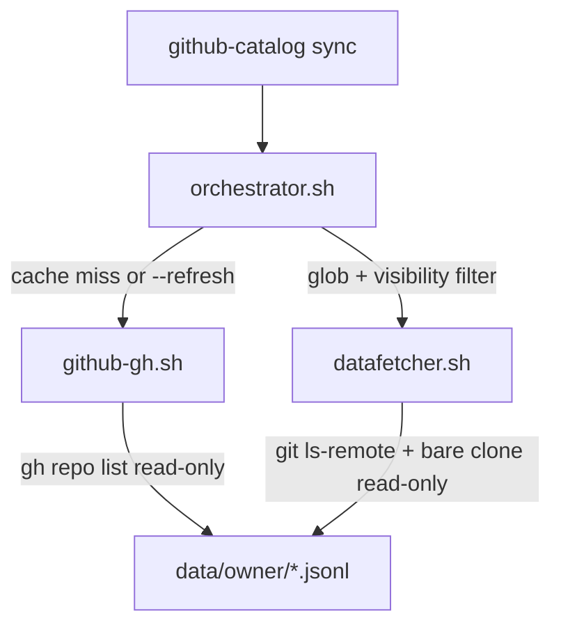

# ADR-002: github-catalog — Unified CLI, GH Bridge, and Read-Only Constraints

**Status:** Accepted  
**Date:** 2026-06-17 (updated 2026-06-18)  
**Environment:** WSL2 · Linux 6.6.114.1-microsoft-standard-WSL2 · x86_64 · Bash 5.0+ · jq 1.7+ · gh 2.45.0  
**Supersedes:** Fragmented multi-entrypoint workflow described in the original ADR-002 draft

## Context

ADR-001 defines the JSONL catalog engine, sentry logic, and script responsibilities. The original operator experience was fragmented across multiple entrypoints (`github-gh.sh`, `orchestrator.sh`, `qobeat-repos.sh`, `test.sh`, `lint.sh`) with verbose internal flags.

This ADR records the **unified CLI architecture** now in production, plus pipeline constraints established during the GH-bridge hardening pass.

## Decision

### 1. Unified CLI (`./github-catalog`)

A single root executable is the **only supported operator and agent interface**. It maps simple commands to internal scripts and auto-resolves paths:

| Command | Purpose |
|---------|---------|
| `sync` | Fetch inventory (when needed), dispatch parallel datafetchers |
| `report` | Generate `reports/<owner>/latest.md` from local JSONL |
| `clean` | Remove local cache for one owner or `all` |
| `test` | Run pure-Bash unit and smoke tests |
| `lint` | Run `bash -n` and ShellCheck |

Internal scripts under `scripts/` must not be invoked directly by users or agents.

### 2. Path auto-resolution

- Sync and report data live under `data/<owner>/`.
- Reports are written to `reports/<owner>/latest.md`.
- Logs append to `logs/github-catalog-<date>.log`.

The CLI passes only the owner name; directory layout is derived automatically.

### 3. GH bridge isolation (`scripts/github-gh.sh`)

**Constraint:** `gh` is permitted **only** inside `github-gh.sh`. No other script may call `gh` or other network APIs.

**Read-only constraint:** The bridge performs a single read operation — `gh repo list` — to discover repository inventory. It must never create, modify, or delete GitHub resources.

**Implementation:** `gh repo list --json …` output is piped to `jq -c --arg …` to produce append-only `user-repositories.jsonl` records. The `gh --jq` flag accepts only a filter expression; jq CLI flags such as `--arg` must be passed to `jq` directly, not to `gh`.

**Visibility normalization:** GitHub returns visibility in uppercase (`PRIVATE`, `PUBLIC`). Records are stored in lowercase (`private`, `public`) so they align with CLI `--type` values and cached-inventory filtering.

### 4. Inventory cache and `gh` prerequisite

On sync, the orchestrator calls `github-gh.sh` when:

1. `data/<owner>/user-repositories.jsonl` does not exist (first sync), **or**
2. `--refresh` is passed (maps to internal `--refresh-repo-list`).

Otherwise the cached inventory is reused and `gh` is not required. The CLI enforces this before dispatch.

### 5. Visibility filter on cached inventory

The `--type private|public|all` flag (CLI) / `--type` (orchestrator) applies in two places:

1. **Fresh fetch:** passed to `gh repo list --visibility` when not `all`.
2. **Cached inventory:** jq filters `user-repositories.jsonl` by normalized visibility before glob matching.

This prevents a cached `--all` inventory from syncing public repos when a later run uses `--private`.

### 6. Parallel dispatch

The orchestrator dispatches `github-catalog-datafetcher.sh` workers with a configurable concurrency limit (`--parallel N`, default 4) and a 1-second inter-dispatch delay. Worker failures are counted; the run exits non-zero if any worker fails.

### 7. Manifest consolidation

Agent instructions live in a single root `MANIFEST.md`. Per-directory manifests and `scripts/qobeat-repos.sh` are deprecated and removed.

## Pipeline overview

## Consequences

- **Positive:** One CLI surface; agents need not learn internal flag wiring. GH access is auditable in a single file. Cached runs work offline from inventory (git still required for collection).
- **Positive:** Visibility and glob filters compose correctly across cached and fresh inventory.
- **Negative:** First sync and `--refresh` require authenticated `gh`. Large owners may need future pagination beyond the current `--limit 1000` default in `github-gh.sh`.
- **Neutral:** JSONL remains append-only; inventory deduplication is by `repo_slug` + latest `generated_at` at read time.

## References

- ADR-001: JSONL schema, sentry logic, datafetcher algorithm
- `docs/github-catalog.schema.json`: record shapes
- `MANIFEST.md` / `README.md`: operator and agent command reference
