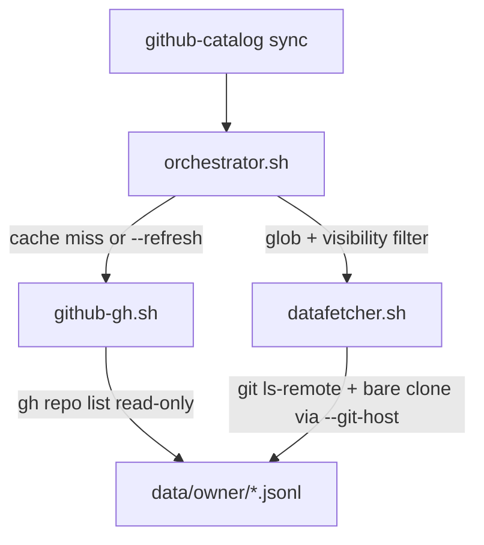

# ADR-002: github-catalog — Unified CLI, GH Bridge, and Read-Only Constraints

**Status:** Accepted  
**Date:** 2026-06-17 (updated 2026-06-18)  
**Environment:** WSL2 · Linux 6.6.114.1-microsoft-standard-WSL2 · x86_64 · Bash 5.0+ · jq 1.7+ · gh 2.45.0  
**Supersedes:** Fragmented multi-entrypoint workflow described in the original ADR-002 draft

## Context

ADR-001 defines the JSONL catalog engine, sentry logic, and script responsibilities. The original operator experience was fragmented across multiple entrypoints (`github-gh.sh`, `orchestrator.sh`, `qobeat-repos.sh`, `test.sh`, `lint.sh`) with verbose internal flags.

This ADR records the **unified CLI architecture** now in production, plus pipeline constraints established during the GH-bridge hardening pass.

### Dual authentication limitation

Sync touches GitHub through **two separate credential paths** that are not automatically aligned:

| Path | Mechanism | Purpose |
|------|-----------|---------|
| Inventory | `gh repo list` (token auth) | Discover repo names for wildcard matching; writes `user-repositories.jsonl` (max 1000 repos) |
| Collection | `git ls-remote` / `git clone --bare` (SSH or HTTPS) | Read commits and README sections into catalog JSONL |

Prior to `--git-host` / `--ssh-key`, operators with SSH Host aliases (e.g. `Host github-personal` + `IdentityFile` in `~/.ssh/config`) hit two failure modes:

1. **Missing inventory** — `gh` authenticated as user A never lists user B's private repos, so glob matching returned zero repos before git was invoked.
2. **Wrong clone URL** — even when inventory contained a repo, `gh` stored HTTPS URLs and the datafetcher defaulted to `git@github.com:…`, bypassing the SSH alias and key that actually grant access.

The tool reported this as "no repository on GitHub" (pointing at `https://github.com/…` or `git@github.com:…`), which looked like a missing local JSONL entry rather than an auth/URL mismatch. Literal repo sync with `--git-host` and optional `--ssh-key` addresses collection; wildcard sync still requires prefetched inventory via `gh` on the correct account.

## Decision

### 1. Unified CLI (`./github-catalog`)

A single root executable is the **only supported operator and agent interface**. It maps simple commands to internal scripts and auto-resolves paths:

| Command | Purpose |
|---------|---------|
| `sync` | Fetch inventory (when needed), dispatch parallel datafetchers |
| `report` | Generate timestamped `reports/<owner>/report-<timestamp>.md` from local JSONL; update `latest.md` symlink |
| `clean` | Remove local cache for one owner or `all` |
| `test` | Run pure-Bash unit and smoke tests |
| `lint` | Run `bash -n` and ShellCheck |

Internal scripts under `scripts/` must not be invoked directly by users or agents.

### 2. Path auto-resolution

- Sync and report data live under `data/<owner>/`.
- Reports are versioned as `reports/<owner>/report-<timestamp>.md`; `reports/<owner>/latest.md` is a symlink to the newest file.
- Logs append to `logs/github-catalog-<date>.log`.

The CLI passes only the owner name; directory layout is derived automatically.

### 3. GH bridge isolation (`scripts/github-gh.sh`)

**Constraint:** `gh` is permitted **only** inside `github-gh.sh`. No other script may call `gh` or other network APIs.

**Read-only constraint:** The bridge performs a single read operation — `gh repo list` — to discover repository inventory. It must never create, modify, or delete GitHub resources.

**Implementation:** `gh repo list --json …` output is piped to `jq -c --arg …` to produce append-only `user-repositories.jsonl` records. The `gh --jq` flag accepts only a filter expression; jq CLI flags such as `--arg` must be passed to `jq` directly, not to `gh`.

**Visibility normalization:** GitHub returns visibility in uppercase (`PRIVATE`, `PUBLIC`). Records are stored in lowercase (`private`, `public`) so they align with CLI `--type` values and cached-inventory filtering.

### 4. Inventory cache and `gh` prerequisite

On sync, the orchestrator calls `github-gh.sh` when inventory is required:

1. `--refresh` is passed (maps to internal `--refresh-repo-list`), **or**
2. The glob contains wildcards (wildcard matching uses prefetched inventory only), **or**
3. `data/<owner>/user-repositories.jsonl` does not exist and the sync is not a literal repo name with `--git-host`.

`gh repo list` fetches up to **1000 repos** by default. Otherwise the cached inventory is reused and `gh` is not required. The CLI enforces the `gh` prerequisite before dispatch when a prefetch would occur.

**Literal repo bypass:** When a literal repo name is not found in inventory, the orchestrator probes `git ls-remote` using `--git-host` / `--ssh-key` before failing. With `--git-host` and no `--refresh`, first sync of a single repo skips `gh` entirely.

### 5. SSH host alias and key (`--git-host`, `--ssh-key`)

Git collection uses `git ls-remote` and `git clone --bare`. Clone URLs default to `git@github.com:owner/repo.git`. When operators use SSH config Host aliases (e.g. `github-personal` with a dedicated `IdentityFile`), pass `--git-host github-personal` so URLs become `git@github-personal:owner/repo.git`. Optional `--ssh-key PATH` sets `GIT_SSH_COMMAND` for explicit key selection. Env fallbacks: `GITHUB_CATALOG_GIT_HOST`, `GITHUB_CATALOG_SSH_KEY`.

When `--git-host` is set, inventory HTTPS URLs from `gh` are rewritten to SSH alias URLs at dispatch time.

### 6. Operator workflow from zero

Practical sequence for cataloging an owner's repositories with no prior local cache (`data/<owner>/` absent).

**Standard account** (`gh` and git both reach the same GitHub user):

| Step | Command | Effect |
|------|---------|--------|
| First — prefetch + catalog | `./github-catalog sync <owner> '<glob>' --refresh` | `gh` appends up to 1000 repos to `user-repositories.jsonl`; matched repos collected in parallel |
| First — report | `./github-catalog report <owner>` | Writes `reports/<owner>/report-<timestamp>.md`; updates `latest.md` symlink |
| Second — incremental sync | `./github-catalog sync <owner> '<glob>'` | Reuses inventory (no `gh`); sentry skips unchanged SHAs |
| Second — report | `./github-catalog report <owner>` | Appends a new timestamped markdown report from JSONL |

**SSH Host alias** (`git` via `~/.ssh/config`, inventory still via `gh`):

| Step | Command | Effect |
|------|---------|--------|
| First — inventory | `gh auth login` then `./github-catalog sync <owner> '*' --refresh` | Builds wildcard-ready inventory |
| First — catalog | `./github-catalog sync <owner> '<glob>' --git-host <alias>` | Clones via `git@<alias>:<owner>/<repo>.git` |
| First — single repo shortcut | `./github-catalog sync <owner> <repo> --git-host <alias>` | Skips `gh`; probes repo via git only |
| Second — catalog | `./github-catalog sync <owner> '<glob>' --git-host <alias>` | Cached inventory + SSH alias; no `gh` unless `--refresh` |
| Refresh inventory | `./github-catalog sync <owner> '<glob>' --refresh` | Re-appends `gh repo list` when repos added or `gh` account changed |

Example (`qobeat`, SSH alias `github-personal`):

```bash
# First run
gh auth login
./github-catalog sync qobeat '*' --refresh
./github-catalog sync qobeat 'ados-*' --git-host github-personal
./github-catalog report qobeat

# Second run (later)
./github-catalog sync qobeat 'ados-*' --git-host github-personal
./github-catalog report qobeat
```

### 7. Visibility filter on cached inventory

The `--type private|public|all` flag (CLI) / `--type` (orchestrator) applies in two places:

1. **Fresh fetch:** passed to `gh repo list --visibility` when not `all`.
2. **Cached inventory:** jq filters `user-repositories.jsonl` by normalized visibility before glob matching.

This prevents a cached `--all` inventory from syncing public repos when a later run uses `--private`.

### 7a. Repository deletion (`status` field, schema 1.2.0)

JSONL records in `user-repositories.jsonl` and `git-projects-catalog.jsonl` carry `status: active|deleted`. On inventory refresh (`--refresh`), repos present in cached inventory but missing from the fresh `gh repo list` (within the same visibility scope) receive append-only tombstone lines with `status: deleted`. The orchestrator then writes matching `repo_snapshot` tombstones that preserve prior semantic fields. Deleted repos are excluded from sync dispatch. Commit history in `git-projects-commits.jsonl` is never removed.

### 8. Parallel dispatch

The orchestrator dispatches `github-catalog-datafetcher.sh` workers with a configurable concurrency limit (`--parallel N`, default 4) and a 1-second inter-dispatch delay. Worker failures are counted; the run exits non-zero if any worker fails.

### 9. Manifest consolidation

Agent instructions live in a single root `MANIFEST.md`. Per-directory manifests and `scripts/qobeat-repos.sh` are deprecated and removed.

## Pipeline overview



## Consequences

- **Positive:** One CLI surface; agents need not learn internal flag wiring. GH access is auditable in a single file. Cached runs work offline from inventory (git still required for collection).
- **Positive:** Visibility and glob filters compose correctly across cached and fresh inventory.
- **Positive:** SSH host aliases support multi-account git access without changing `gh` auth; literal single-repo sync works without inventory.
- **Negative:** Wildcard sync still requires prefetched inventory via authenticated `gh` (max 1000 repos). SSH alias does not replace `gh` for discovery.
- **Negative:** First sync and `--refresh` require authenticated `gh` when inventory is needed. Large owners may need future pagination beyond the current `--limit 1000` default in `github-gh.sh`.
- **Neutral:** JSONL remains append-only; inventory deduplication is by `repo_slug` + latest `generated_at` at read time.

## References

- ADR-001: JSONL schema, sentry logic, datafetcher algorithm
- `docs/github-catalog.schema.json`: record shapes
- `MANIFEST.md` / `README.md`: operator and agent command reference
